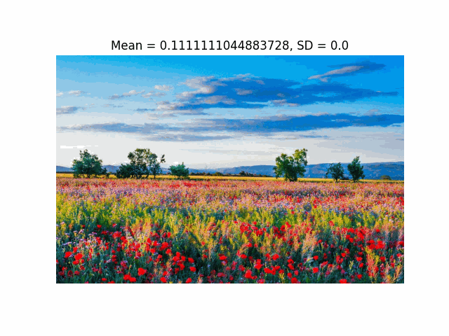
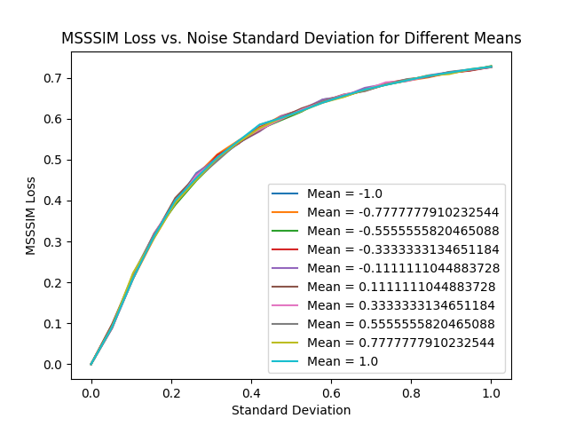

# COMP4471 2024F Image Denoising

In this projet, we focused on the implementation of two popular deep learning models of DnCNN and GANs.

DnCNN is a deep learning model which is especially designed for denoising images. It uses Squeeze and Exapand Blocks, along with Residual Block

The GAN model consists of a Generator and a Discriminator, where the Generator is optimised to give as small of a MSSIM loss as possible

Team members:

- Harsh Vardhan Gupta
- Wai Kit Lam
- Ming Chak Ho

## Behavior of the MS-SSIM Loss

